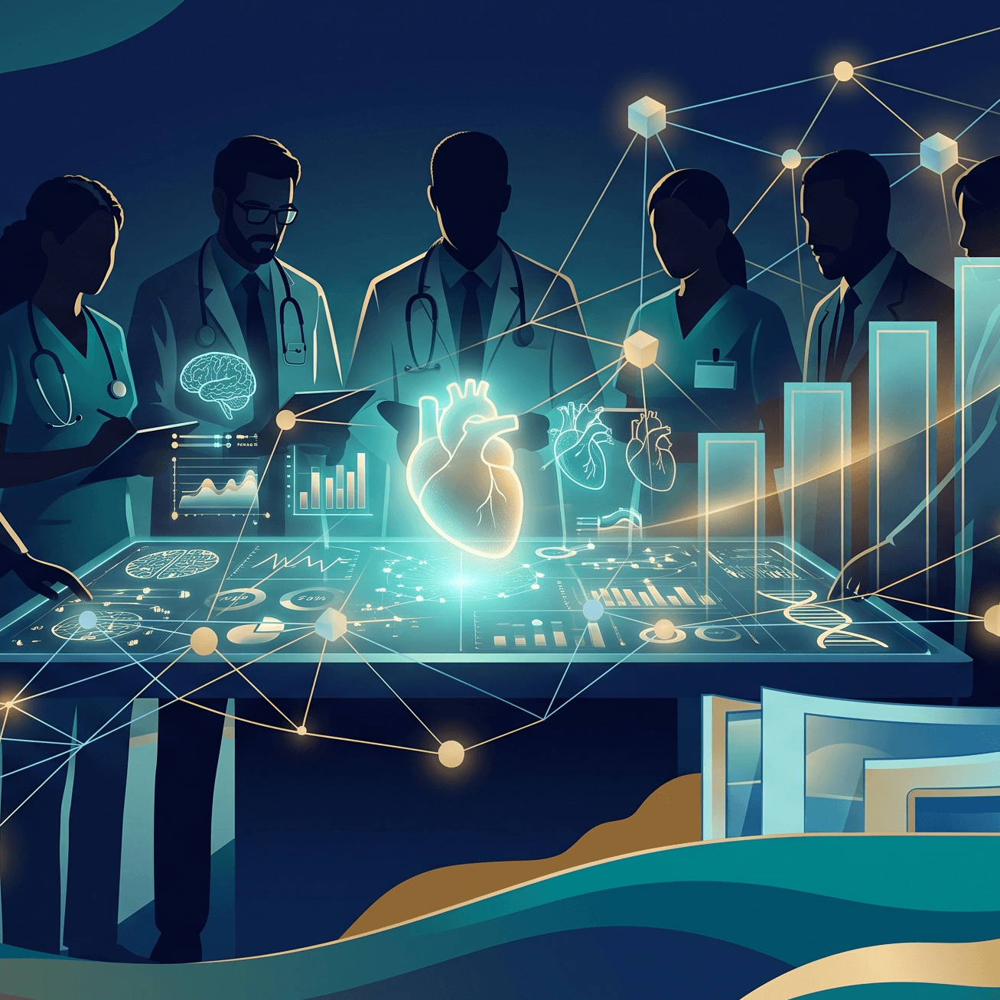
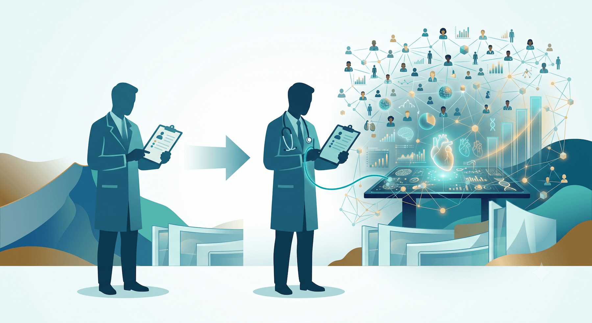
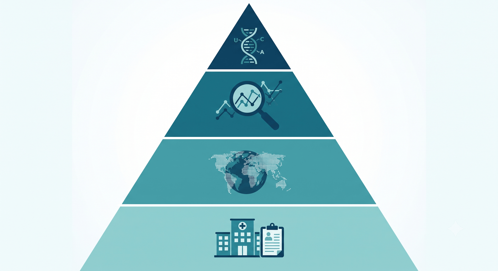
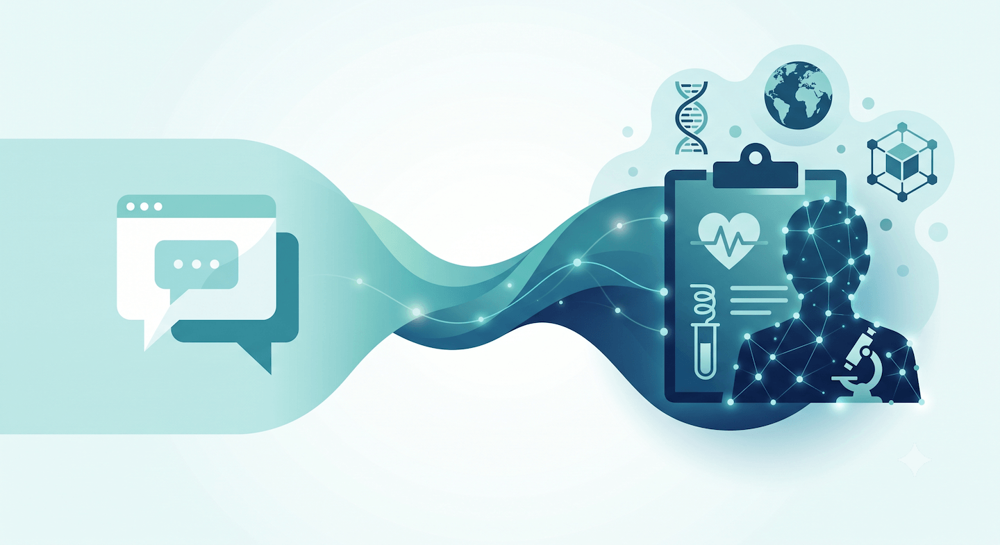
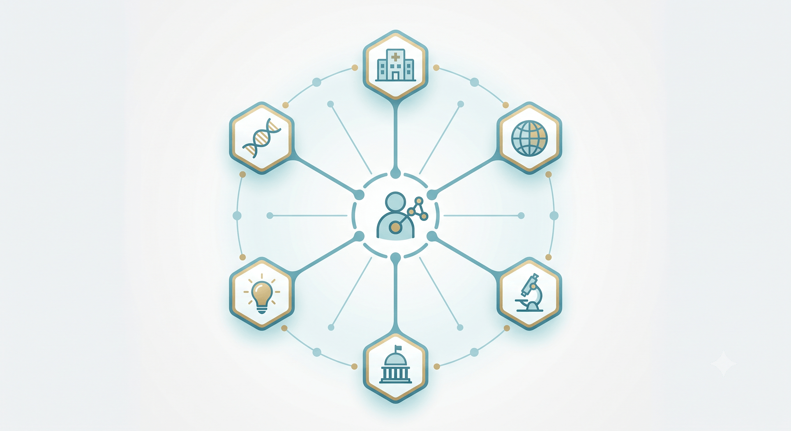
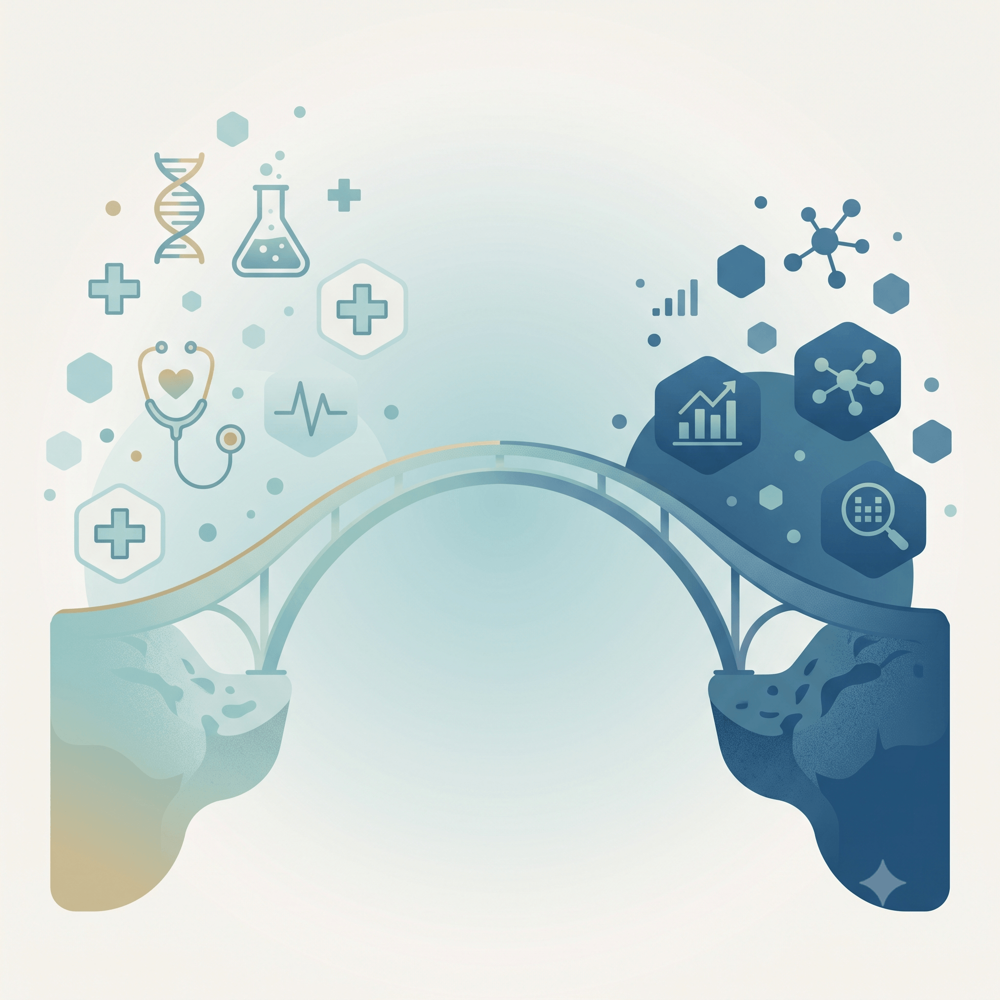
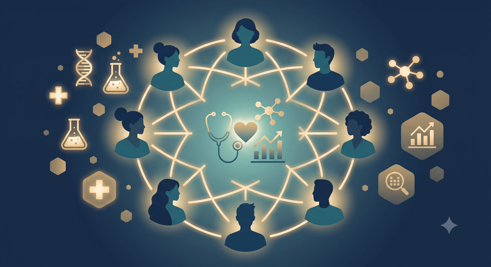

## Bienvenidos a un momento histórico

:::: {.columns}

::: {.column width="55%"}
  

Esta no es la apertura de un posgrado más.

Es el inicio de algo que no existía en Guatemala hace un año.

:::

::: {.column width="45%"}
{fig-align="center" style="border-radius: 12px;"}
:::

::::

::: notes
[~0-3 min] Abrir con calma y presencia. Reconocer a autoridades de USAC, a la gerencia del programa, y a los estudiantes.
Pausa antes de hablar — que el silencio genere expectativa.
Frase sugerida: "Hoy es el primer día de algo nuevo en Guatemala."
:::

---

## Una pregunta para arrancar

 

> *¿Cuántos de ustedes alguna vez tomaron una decisión clínica, de política pública, o de gestión… y desearon tener más datos?*

 

. . .

> *¿Y cuántos tenían los datos pero no sabían qué hacer con ellos?*

 

. . .

**Esa brecha es exactamente la que esta maestría existe para cerrar.**

::: notes
[~3-5 min] Pedir manos levantadas para cada pregunta. Usar el resultado como punto de partida.
Si la mayoría levanta la mano en ambas: "Eso me dice que están en el lugar correcto."
:::

---

## Guatemala: nuestra realidad en datos {.smaller}

:::: {.columns}

::: {.column width="50%"}

**El problema que enfrentamos:**

- 🏥 **~0.3 médicos** por cada 1,000 habitantes (OMS recomienda 1)
- 🍬 **12% de adultos** con diabetes, muchos sin diagnóstico
- 🦟 **+60,000 casos de dengue** en el brote de 2023
- 👶 **108 muertes maternas** por cada 100,000 nacidos vivos
- 🌽 **46% de niños menores de 5 años** con desnutrición crónica

:::

::: {.column width="50%"}

**Lo que hay disponible:**

- Décadas de datos del MSPAS
- Registros hospitalarios del IGSS
- Datos de laboratorio, vacunación, epidemiología
- Registros de programas de salud comunitaria

 

**El problema:** casi nadie está formado para convertir esos datos en decisiones.

:::

::::

::: notes
[~5-7 min] Estos números no son para desanimar — son para contextualizar la urgencia y la oportunidad.
Énfasis: "Guatemala ya tiene los datos. Lo que no tiene es suficiente gente formada para usarlos."
Si hay personas del MSPAS o del IGSS, reconocerlos: "algunos de ustedes trabajan con esos datos todos los días."
:::

---

## La historia de la Señora María {.smaller}

 

> *María tiene 52 años, vive en Chimaltenango, y lleva tres años con diabetes tipo 2. Su médico la controla bien en cada consulta. Sus exámenes son razonables. Todo parece en orden.*

. . .

> *Lo que nadie sabe: en ese departamento, el 38% de los pacientes diabéticos como María abandonan el control antes del cuarto mes. El patrón se repite en cada clínica. Siempre en pacientes que viven a más de 40 minutos del centro.*

. . .

> *Nadie lo ha analizado. Los datos existen. Están en los registros. Pero duermen.*

. . .

**Ciencia de datos en salud es despertar esos datos.**

::: notes
[~7-10 min] Esta historia es la columna vertebral de toda la lección. Volver a ella en cada nivel.
La historia es ficticia pero representativa de patrones reales.
Dejar que la última frase aterrice en silencio antes de pasar al siguiente slide.
:::

---

## Lo que vamos a recorrer hoy {.smaller}

 

| Sección | Tema | Tiempo |
|---------|------|--------|
| I | Por qué la ciencia de datos importa — y por qué ustedes | ~8 min |
| II | Los cuatro niveles: de la consulta a la bioinformática | ~20 min |
| III | Inteligencia artificial y el futuro del campo | ~15 min |
| IV | Su viaje: la maestría, las herramientas, quiénes van a ser | ~10 min |
| — | Cierre y preguntas | ~5 min |

::: notes
[~10 min] Dar el mapa — que la audiencia sepa en todo momento dónde están dentro de la hora.
:::

## 

  

::: {style="text-align: center; font-size: 2em; font-weight: bold; letter-spacing: 0.05em;"}
Parte I
:::

::: {style="text-align: center; font-size: 1.1em; color: #90b8cc; margin-top: 0.5em;"}
Por qué la ciencia de datos importa — y por qué ustedes
:::

---

## Ustedes ya hacen ciencia de datos {.smaller}

:::: {.columns}

::: {.column width="50%"}

**Lo que hacen como profesionales de salud:**

- Reúnen información sobre un paciente
- Identifican patrones clínicos
- Formulan hipótesis (diagnóstico diferencial)
- Evalúan evidencia (labs, imágenes, historial)
- Toman una decisión y la ajustan con el tiempo

:::

::: {.column width="50%"}

**Lo que hace un científico de datos:**

- Reúne datos de múltiples fuentes
- Identifica patrones en grandes conjuntos
- Formula hipótesis (modelos predictivos)
- Evalúa evidencia (estadística, validación)
- Toma decisiones y las refina iterativamente

:::

::::

. . .

> **La diferencia no es el proceso — es la escala.**\
> Ustedes lo hacen para 1 paciente.\
> La ciencia de datos lo hace para 100,000.

::: notes
[~11-14 min] Este es el slide más importante para desactivar el miedo.
"No están aprendiendo algo ajeno. Están ampliando lo que ya saben hacer."
Si hay médicos en la sala: "El diagnóstico diferencial es hipótesis estadística. Solo que nadie les dijo así."
:::

---

## La diferencia es la escala

{fig-align="center" style="max-height: 55vh;"}

::: notes
[~14-16 min] Si la imagen no está lista, describir con palabras:
"Imaginen que pudieran ver los registros de todos los pacientes diabéticos del IGSS de los últimos 10 años al mismo tiempo."
:::

---

## De los datos a las decisiones

{fig-align="center"}

::: notes
[~16-18 min] Analogía médica: "Así como un médico no diagnostica con una muestra sin procesar — la manda al laboratorio, la analiza, la interpreta — así funciona la ciencia de datos."
El flujo es siempre el mismo: recolección → limpieza → análisis → interpretación → decisión.
:::

---

## 

  

::: {style="text-align: center; font-size: 2em; font-weight: bold; letter-spacing: 0.05em;"}
Parte II
:::

::: {style="text-align: center; font-size: 1.1em; color: #90b8cc; margin-top: 0.5em;"}
Los cuatro niveles: de la consulta a la bioinformática
:::

---

## Un campo con cuatro pisos

{fig-align="center" style="max-height: 55vh;"}

::: notes
[~18-20 min] Decir que van a recorrer los cuatro pisos en los próximos 15 minutos.
"Cada nivel es más complejo, pero no más importante. La clínica de pueblo necesita nivel 1 tanto como el ministerio necesita nivel 2."
:::

---

## Nivel 1: La sala de consulta {.smaller}

**Ciencia de datos en la práctica clínica**

- Análisis de registros hospitalarios
- Identificación de patrones: tratamientos, medicamentos, reingresos
- Mejora en la gestión y atención

. . .

**Volvamos a María:**\
Un análisis de 5 años revela que el 38% de los diabéticos abandona el control antes del cuarto mes — todos viven a más de 40 min del centro.

→ La solución no es clínica: es de acceso. Los datos lo revelaron.

::: notes
[~20-23 min] Conectar siempre con la historia de María.
Énfasis: "Esto no requiere inteligencia artificial. Requiere mirar los datos que ya existen."
:::

---

## Nivel 1: Visualización

{fig-align="center"}

> "A veces, una sola visualización revela el patrón que cambia la intervención."

::: notes
[~23-24 min] Pasar relativamente rápido si la imagen habla por sí sola.
:::

---

## Nivel 2: El país como paciente {.smaller}

**Salud pública y epidemiología digital**

- Datos poblacionales → decisiones de política
- Vigilancia epidemiológica, predicción de brotes
- Optimización de recursos a escala nacional

. . .

**El caso del dengue 2023:**\
Los datos de temperatura, lluvias y vectores daban señales semanas antes del brote.\
Un sistema de alerta temprana habría permitido fumigación preventiva con 3-4 semanas de anticipación.

→ **Menos casos. Menos muertes. Mismo presupuesto.**

::: notes
[~24-27 min] Dengue es muy relevante para la audiencia guatemalteca — casi todos lo han visto en su práctica.
Énfasis: "Esto no es ciencia ficción. Varios países de la región ya tienen sistemas así."
:::

---

## Nivel 2: Vigilancia epidemiológica

{fig-align="center"}

**Lo que un dashboard permite preguntar:**

- ¿Dónde están los focos activos? · ¿Cuál es la tendencia semanal? · ¿Qué población está más expuesta?

::: notes
[~27-28 min] El tablero de COVID es el ejemplo más conocido. Conectar con dengue y con lo que Guatemala podría tener.
:::

---

## Nivel 3: La evidencia que cambia protocolos {.smaller}

**Ciencia de datos en investigación clínica**

- Evaluación de tratamientos y pronósticos
- Análisis de supervivencia, modelos de riesgo
- Datos del mundo real (*real-world evidence*)

. . .

**Ejemplo:**\
10 años de historias clínicas del IGSS permiten comparar protocolos de preeclampsia sin necesitar un nuevo ensayo clínico.

→ **Investigación con los datos que ya tenemos.**

::: notes
[~28-32 min] Este nivel conecta con investigadores y con clínicos que quieren publicar.
"Real-world evidence" es uno de los campos con más crecimiento — porque los ensayos clínicos son caros y lentos, pero los registros clínicos están llenos de datos reales.
:::

---

## Nivel 3: Curvas de supervivencia  {background-color="#fff"}

{fig-align="center"}

"Los datos clínicos permiten evaluar si un tratamiento realmente cambia la historia natural de la enfermedad."

::: notes
[~32-33 min] Explicar brevemente qué muestra la curva (probabilidad de sobrevivir en el tiempo, por grupo de tratamiento). No entrar en estadística — solo el concepto.
:::

---

## Nivel 4: Cuando los genes hablan {.smaller}

**Bioinformática clínica**

- Análisis de datos genómicos y moleculares
- Identificación de mutaciones y biomarcadores
- Medicina de precisión: el tratamiento correcto, para el paciente correcto

. . .

**En Guatemala:**\
Nuestra población tiene una genética única — mezcla maya, española y africana.\
Los modelos entrenados en Europa **no siempre funcionan aquí**. Necesitamos datos propios y bioinformáticos que los analicen.

::: notes
[~33-36 min] El argumento de la genética local es poderoso: los estudios de riesgo cardiovascular o de respuesta a medicamentos son distintos en nuestra población. Si no formamos bioinformáticos aquí, dependemos de modelos hechos para otros.
:::

---

## Nivel 4: Medicina de precisión

{fig-align="center"}

::: notes
[~36-37 min] Ejemplo EGFR: el mismo diagnóstico de "cáncer de pulmón" tiene tratamientos completamente distintos según la mutación. Sin datos genómicos, todos reciben el mismo tratamiento. Con datos, se personaliza.
:::

---

## Una nota que no podemos saltarnos {.smaller}

> *Los datos de salud son de las personas — no del sistema.*

- **Privacidad:** Consentimiento informado, anonimización, acceso controlado
- **Equidad:** Los modelos pueden reproducir sesgos existentes — o corregirlos
- **Interpretación:** Un dato nunca habla solo; necesita contexto clínico
- **Responsabilidad:** Quien analiza los datos comparte la responsabilidad del impacto

**La ciencia de datos sin ética es solo vigilancia.**

::: notes
[~37-39 min] No saltar este slide. Si hay tiempo: preguntar si alguien tiene un ejemplo de sesgo en datos de salud que haya observado en su práctica.
:::

---

## Recapitulación: los cuatro niveles

| Nivel | Aplicación | Ejemplo Guatemala |
|-------|------------|-------------------|
| 1 | Clínica | Abandono de control en pacientes diabéticos |
| 2 | Salud pública | Alerta temprana de dengue |
| 3 | Investigación | Comparar protocolos de preeclampsia |
| 4 | Bioinformática | Modelos de riesgo para nuestra población |

::: notes
[~39-40 min] Pausa de síntesis. Preguntar si hay preguntas antes de pasar a IA.
Este es el fin de la segunda parte — de aquí en adelante hablamos del horizonte.
:::

---

## 

  

::: {style="text-align: center; font-size: 2em; font-weight: bold; letter-spacing: 0.05em;"}
Parte III
:::

::: {style="text-align: center; font-size: 1.1em; color: #90b8cc; margin-top: 0.5em;"}
Inteligencia artificial y el futuro del campo
:::

---

## ¿Existe un Nivel 5?

{fig-align="center"}

::: notes
[~40-42 min] Transición dramática: "Recapitulamos los cuatro niveles. Pero el campo no se detiene ahí."
:::

---

## El mapa de la inteligencia artificial

{fig-align="center"}

::: notes
[~42-44 min] IA → Machine Learning → Deep Learning. No entrar en detalle técnico — solo ubicar los conceptos anidados.
"Deep learning es el motor detrás de casi todo lo que vamos a ver a continuación."
:::

---

## ¿Qué es una red neuronal? {.smaller}

:::: {.columns}

::: {.column width="50%"}

Piénsalo como un **sistema de toma de decisiones** inspirado en el cerebro:

- **Entradas**: Datos crudos (ej., valores de píxeles de una radiografía)
- **Capas ocultas**: Cada capa aprende a detectar patrones más complejos
- **Salida**: Una predicción ("esta radiografía muestra signos de neumonía")

La red **aprende por ejemplo** — le mostramos miles de imágenes ya etiquetadas, y ella descubre qué patrones corresponden a cada diagnóstico.

:::

::: {.column width="50%"}

{width="85%" fig-align="center"}

:::

::::

::: notes
[~44-46 min] Analogía del médico residente: "Una red neuronal aprende como un residente. Al principio se equivoca. Con miles de casos, mejora. La diferencia es que puede revisar un millón de casos en una noche."
:::

---

## IA leyendo radiografías

{fig-align="center"}

::: notes
[~46-47 min] Modelos de visión ya validados en radiología.
Énfasis: el modelo no reemplaza al radiólogo — le da una segunda opinión a las 3am, cuando el cansancio afecta la precisión.
:::

---

## IA leyendo radiografías

{fig-align="center"}

::: notes
[~47-48 min] Mostrar la predicción del modelo. Transición natural hacia: "si una red puede aprender del lenguaje de las imágenes... ¿qué pasa cuando aprende el lenguaje de las palabras?"
:::

---

## Las LLMs predicen la siguiente palabra

{fig-align="center"}

::: notes
[~48-49 min] La intuición fundamental de los LLMs: predecir la siguiente palabra en secuencia, entrenados en textos masivos.
:::

---

## Tokenizar el lenguaje

:::: {.columns}

::: {.column width="50%"}

{fig-align="center"}

:::

::: {.column width="50%"}

{fig-align="center"}

:::

::::

> Los modelos no leen palabras — leen números.\
> Cada *token* se convierte en un vector matemático (*embedding*).\
> El "significado" queda codificado en ese vector.

::: notes
[~49-51 min] No profundizar en la matemática — solo transmitir la idea.
:::

---

## Las palabras similares están cerca

{fig-align="center"}

> *"Diabetes" y "glucosa" terminan cercanas en ese espacio.\
> El modelo aprende relaciones médicas sin que nadie se las enseñe explícitamente.*

::: notes
[~51-52 min] Este concepto es el puente fundamental hacia APOLLO — guardar el pensamiento.
:::

---

## Los chatbots que ya conocen

{fig-align="center"}

::: notes
[~52-53 min] "ChatGPT, Gemini, Claude... todos funcionan con el mismo principio que acaban de ver."
:::

---

## Una pregunta que cambió el campo

{fig-align="center" style="max-height: 38vh;"}

> *Si un modelo puede aprender el "lenguaje" de las palabras...*\
> *¿puede aprender el "lenguaje" completo de un paciente?*

::: notes
[~53-54 min] Pausa dramática. "No el historial escrito en notas — sino toda su información: labs, imágenes, signos vitales, medicamentos, diagnósticos... todo al mismo tiempo, a lo largo del tiempo."
:::

---

## APOLLO — Representación virtual de un paciente {.smaller}

{fig-align="center" style="max-height: 48vh;"}

**La idea central:** usar la misma arquitectura de los LLMs para aprender el "lenguaje" completo del historial clínico de un paciente: notas, laboratorios, imágenes, signos vitales, todo junto.

::: notes
[~54-55 min] APOLLO es un paper de 2026 — investigación de frontera. Poner en contexto: "No es un producto disponible. Es el horizonte hacia donde va el campo."
:::

---

## APOLLO — El embedding de un paciente

{fig-align="center"}

> Así como "diabetes" tiene un punto en el espacio de los embeddings...\
> **un paciente completo** puede tener un punto en un espacio médico de alta dimensión.

::: notes
[~55 min] La conexión con embeddings que explicamos antes. Un "patient embedding" es la representación matemática de todo su historial.
:::

---

## APOLLO — Encontrar pacientes similares

{fig-align="center"}

**¿Para qué sirve en la práctica?**

- Buscar en millones de historias clínicas el caso más parecido al tuyo
- Anticipar evoluciones basándose en casos similares pasados
- Apoyar decisiones con evidencia real de la propia institución

::: notes
[~55-56 min] Preguntar: "¿Cuántas veces quisieron saber cómo evolucionó un caso parecido en otro hospital?"
:::

---

## APOLLO — El espacio de los pacientes

{fig-align="center" style="max-height: 50vh;"}

::: aside
Zhang A, Ding T, Wagner SJ, et al. A multimodal and temporal foundation model for virtual patient representations at healthcare system scale. arXiv:2604.18570, 2026.
:::

---

## APOLLO — Predicciones clínicas

{fig-align="center" style="max-height: 50vh;"}

::: aside
Zhang A, Ding T, Wagner SJ, et al. A multimodal and temporal foundation model for virtual patient representations at healthcare system scale. arXiv:2604.18570, 2026.
:::

---

## APOLLO — Notas clínicas integradas

{fig-align="center"}

::: aside
Zhang A, Ding T, Wagner SJ, et al. A multimodal and temporal foundation model for virtual patient representations at healthcare system scale. arXiv:2604.18570, 2026.
:::

::: notes
[~56-57 min] APOLLO puede integrar notas en lenguaje natural con datos estructurados. Relevante para sistemas donde la documentación es incompleta o mixta.
:::

---

## ¿Qué significa todo esto para Guatemala? {.smaller}

:::: {.columns}

::: {.column width="50%"}

**Lo que la IA puede hacer:**

- Leer imágenes médicas con alta precisión
- Procesar texto clínico en español
- Encontrar patrones en millones de registros
- Anticipar riesgos individuales y poblacionales

:::

::: {.column width="50%"}

**Lo que la IA NO puede hacer sola:**

- Saber qué pregunta clínica vale la pena hacer
- Interpretar resultados con criterio médico y cultural
- Adaptar un modelo entrenado en EEUU a nuestra población
- Tomar decisiones éticas sobre uso de datos

:::

::::

 

> **Eso lo hacen ustedes.**

::: notes
[~57-58 min] Este es el argumento central de toda la presentación: la IA necesita profesionales de salud con criterio de datos.
:::

## 

::: {style="text-align: center; font-size: 2em; font-weight: bold; letter-spacing: 0.05em;"}
Parte IV
:::

::: {style="text-align: center; font-size: 1.1em; color: #90b8cc; margin-top: 0.5em;"}
Su viaje: la maestría y quiénes van a ser
:::

---

## Lo que van a aprender {.smaller}

:::: {.columns}

::: {.column width="33%"}

**Fundamentos**

- Estadística aplicada a salud
- Bases de datos clínicos
- Epidemiología cuantitativa
- Ética y gobernanza de datos

:::

::: {.column width="33%"}

**Herramientas**

- R y Python para análisis de datos
- SQL para bases de datos clínicas
- Visualización (ggplot2, Shiny)
- Machine learning aplicado a salud

:::

::: {.column width="33%"}

**Aplicaciones**

- Vigilancia epidemiológica digital
- Modelos de predicción clínica
- Análisis de supervivencia
- Introducción a bioinformática

:::

::::

 

> *No necesitan saber programar hoy.\
> Necesitan estar dispuestos a aprender.*

::: notes
[~58-62 min] Dar panorama del currículo sin entrar en detalles administrativos.
"La curva de aprendizaje es real, pero la pendiente no es vertical. Empezamos desde cero juntos."
:::

---

## Quiénes van a ser

{fig-align="center" style="max-height: 50vh;"}

::: notes
[~62-65 min] Recorrer los 6 caminos: analítica hospitalaria, salud pública/OPS/OMS, investigación, política de salud, health tech, bioinformática.
"El campo es nuevo y amplio — hay espacio para todos."
:::

---

## El perfil único que tienen

:::: {.columns}

::: {.column width="50%"}

{fig-align="center" style="max-height: 45vh;"}

:::

::: {.column width="50%"}

Un programador puro no sabe qué pregunta clínica importa.

Un clínico puro no puede analizar 100,000 registros.

**Ustedes son el puente.**

Entienden al paciente **y** aprenderán a hablarle a los datos.

Esa combinación es la más escasa y la más valiosa del campo.

:::

::::

::: notes
[~65-67 min] Slide de identidad profesional. Que salgan sabiendo exactamente quiénes son y por qué importan.
:::

---

## Una comunidad que empieza hoy

{fig-align="center" style="max-height: 35vh;"}

> Los errores y aprendizajes de esta primera cohorte van a definir el camino para las que vienen.\
> No están solos en esto.

::: notes
[~67-68 min] Sentido de comunidad y legado. Cerrar esta sección con calidez.
:::

---

## Lo que les pido para este camino {.smaller}

. . .

**Traigan su curiosidad clínica** — es su ventaja, no su limitación.

. . .

**No teman al código ni a la estadística** — son herramientas. Se aprenden con práctica, con paciencia y con buenos profesores.

. . .

**Pregúntense siempre:** *¿este análisis ayuda de verdad al paciente? ¿Al sistema? ¿A las comunidades más vulnerables?*

. . .

**Tengan paciencia con el proceso** — un semestre los va a desafiar. Dos semestres los van a transformar.

::: notes
[~68-70 min] Cierre motivacional. Hablar despacio, con peso en cada punto.
:::

---

## Conclusiones {.smaller}

- Los datos de salud existen en Guatemala — lo que falta es gente formada para usarlos.

- La ciencia de datos en salud no reemplaza al profesional clínico: lo amplifica.

- Los cuatro niveles van de lo cotidiano a la bioinformática — todos necesarios, todos complementarios.

- La IA (modelos de visión, LLMs, representaciones de paciente como APOLLO) ya es parte del horizonte real del campo.

- **Esta maestría existe para que Guatemala no espere a que el futuro llegue de afuera.**

::: notes
[~70 min] Resumen rápido. La última frase es el cierre emocional — dar peso a cada palabra.
:::

---

## 

  

> *"En cinco años, cuando alguien pregunte quién empezó la ciencia de datos en salud en Guatemala, la respuesta van a ser ustedes."*

 

**¡Bienvenidos, primera generación!**

 

::: {style="font-size: 0.85em; color: #a0b8c8;"}
📧 oliver.mazariegos98@gmail.com · 💬 [linkedin.com/in/oliver-mazariegos](https://www.linkedin.com/in/oliver-mazariegos)
:::

::: notes
[~70 min] Dar espacio para aplausos. Invitar preguntas.
Si hay autoridades de USAC o la gerencia del programa presentes, cederles la palabra.
:::
