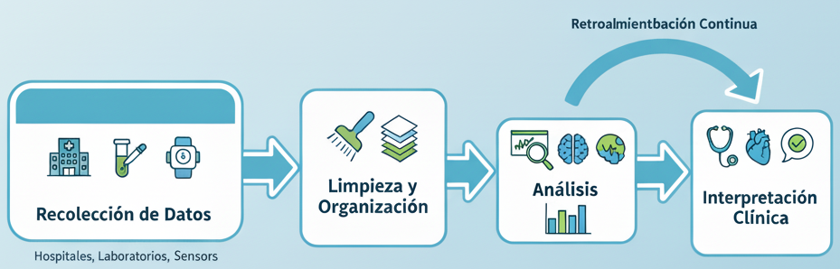
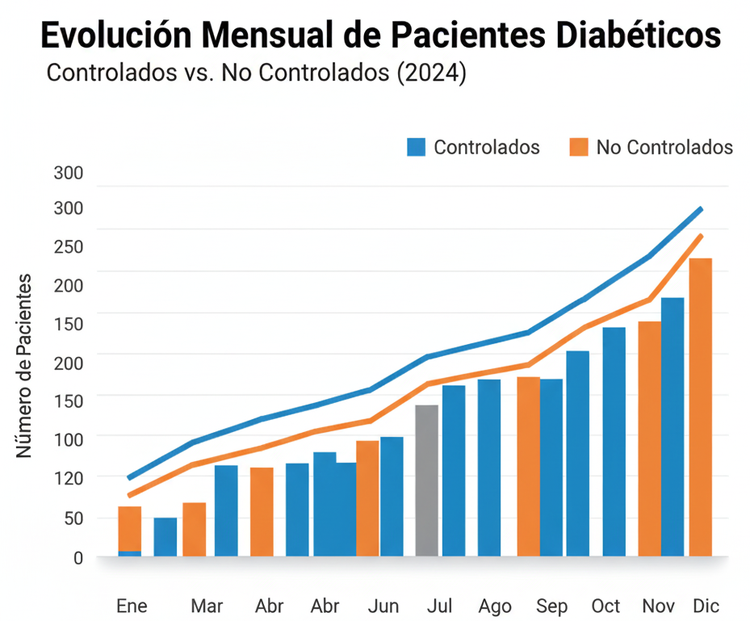
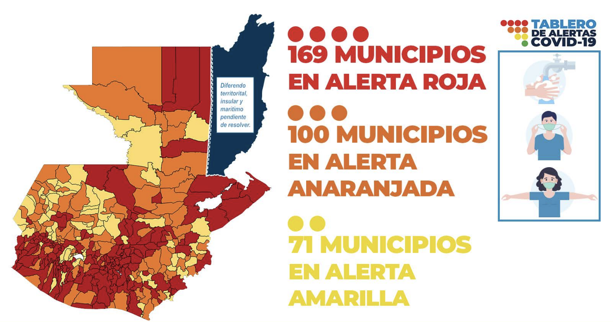
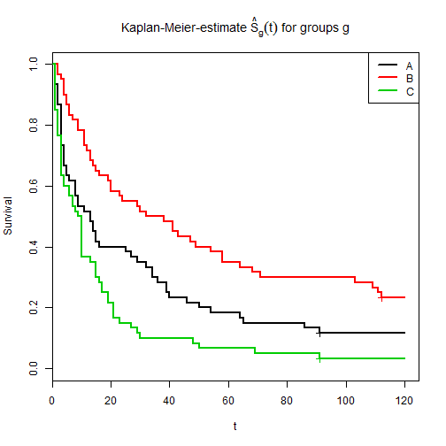
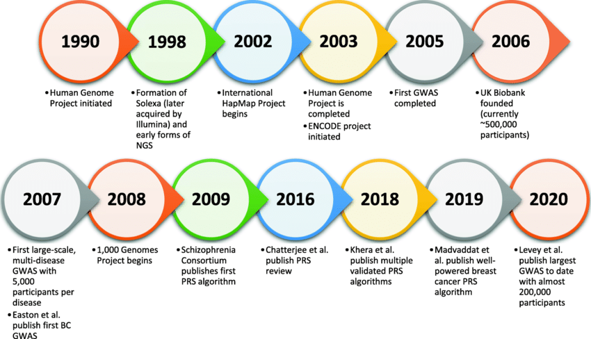
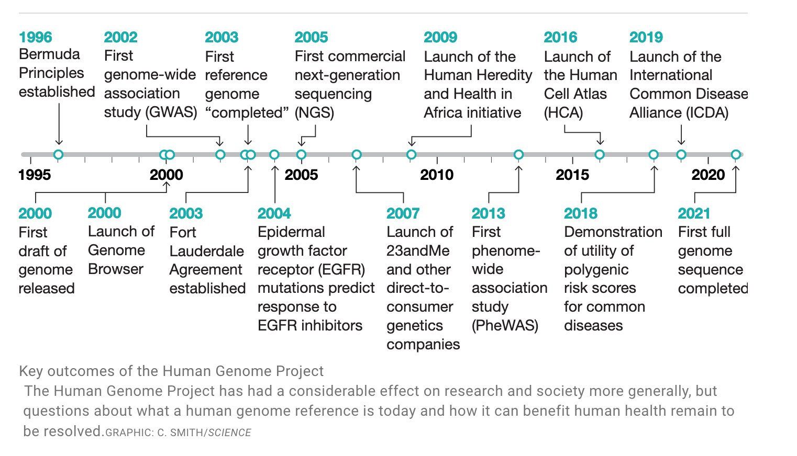
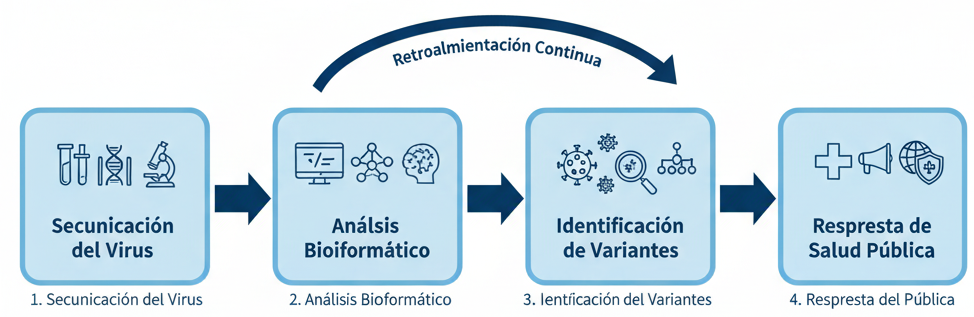
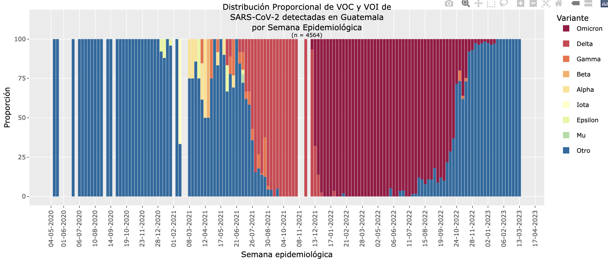
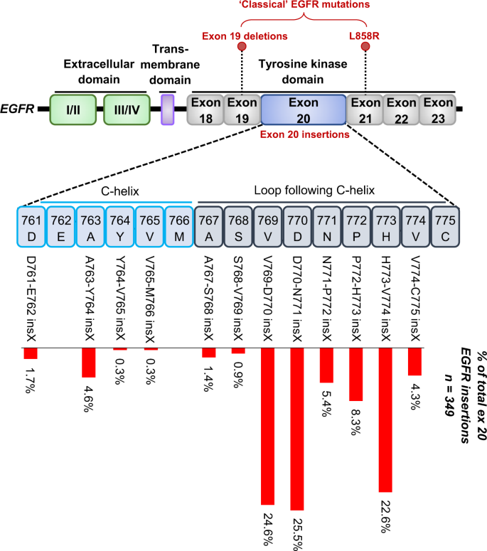

## Introducción

**¿Por qué hablar de Ciencia de Datos en Salud?**

-   Generamos más datos que nunca: historias clínicas, laboratorios, imágenes, genómica.
-   Pero los datos por sí solos **no significan nada** sin análisis.
-   La ciencia de datos convierte los datos en **decisiones clínicas, políticas y científicas.**

::: notes
Presentarte brevemente y contextualizar el crecimiento de los datos en salud.\
Ejemplo: "Hoy, cada hospital genera más datos que toda la OMS hace 30 años."\
Enfatiza que el valor está en el análisis, no en la cantidad.
:::

------------------------------------------------------------------------

## De los datos a la salud

{fig-align="center"}

**De los datos a las decisiones**

1.  Recolección (hospital, laboratorio, sensores)

2.  Limpieza y organización

3.  Análisis

4.  Interpretación clínica

::: notes
Explicar cómo los datos se transforman en conocimiento útil.\
Usar una analogía médica: “Así como un médico limpia y analiza una muestra antes del diagnóstico, un analista limpia y analiza los datos antes de sacar conclusiones.”
:::

------------------------------------------------------------------------

## Nivel 1: Ciencia de datos en la práctica clínica

-   Análisis de registros hospitalarios (Excel, R, Python)
-   Identificación de patrones: tratamientos, medicamentos, reingresos
-   Mejora en la gestión hospitalaria

**Ejemplo:**\
Un hospital analiza datos de pacientes con diabetes →\
detecta que el 30% abandona el tratamiento después del tercer mes.

::: notes
Resalta que esto es ciencia de datos aplicada, aunque se use Excel o R básico.\
Muestra cómo se puede pasar de datos sueltos a decisiones concretas.
:::

------------------------------------------------------------------------

## Ejemplo visual

{fig-align="center"}

> "A veces, una simple visualización puede revelar un patrón que salva recursos o mejora la atención."

::: notes
Mostrar un gráfico de líneas o barras con la evolución mensual de pacientes diabéticos controlados vs. no controlados.
:::

------------------------------------------------------------------------

## Nivel 2: Salud pública y epidemiología digital

-   Datos a gran escala → decisiones poblacionales\
-   Dashboards, vigilancia epidemiológica, predicción de brotes\
-   Ejemplo: COVID-19, dengue, influenza

**Herramientas:** R, Shiny, Power BI, Tableau

::: notes
Menciona cómo los dashboards ayudaron durante la pandemia.\
Enfatiza que la ciencia de datos permite anticipar brotes y optimizar recursos.
:::

------------------------------------------------------------------------

## Ejemplo: Vigilancia de COVID-19

{fig-align="center"}

**Preguntas que se pueden responder:** - ¿Dónde están los focos más activos? - ¿Hay relación geográfica existente? - ¿Cómo cambia semana a semana?

::: notes
Muestra cómo un mapa o una serie temporal ayuda a dirigir campañas de prevención.
:::

------------------------------------------------------------------------

## Nivel 3: Ciencia de datos en investigación clínica

-   Evaluación de tratamientos y pronósticos
-   Curvas de supervivencia (Kaplan-Meier)
-   Modelos de riesgo y predicción

**Ejemplo:**\
Predicción de riesgo de infarto usando presión, colesterol, edad y hábitos.

::: notes
Destaca que aquí ya se aplican modelos estadísticos o de machine learning.\
Explica que el objetivo es apoyar, no reemplazar al médico.
:::

------------------------------------------------------------------------

## Visualización: Curva de supervivencia

{fig-align="center"}

> "Los datos clínicos permiten evaluar si un tratamiento realmente mejora la supervivencia."

::: notes
Explica qué significa cada curva y cómo ayuda a comparar tratamientos.
:::

------------------------------------------------------------------------

## Ética y privacidad de los datos

-   Los datos de salud son sensibles.\
-   Cumplimiento de normas: consentimiento, anonimización, gobernanza de datos.\
-   Ciencia de datos responsable = confianza pública.

::: notes
Enfatiza la importancia ética y legal del uso de datos.\
Menciona ejemplos de buenas prácticas (codificación de pacientes, acceso controlado).
:::

------------------------------------------------------------------------

## Nivel 4: Bioinformática clínica

> “El nivel más avanzado de ciencia de datos en salud.”

-   Análisis de datos genómicos y moleculares.\
-   Identificación de mutaciones, biomarcadores y tratamientos personalizados.\
-   Aplicaciones en virología, enfermedades raras y oncología.

::: notes
Explica brevemente qué es la bioinformática: aplicar algoritmos y modelos sobre datos biológicos.
:::

------------------------------------------------------------------------

## Cronología de la genómica

{fig-align="center"}

::: notes
The HapMap project was an international collaboration to create a "haplotype map" of the human genome, which identifies common patterns of human genetic variation

ENCODE is a public research consortium aimed at identifying all functional elements in the human and mouse genomes.

Polygenic Risk Score (PRS) algorithms in genetics, which calculate an individual's risk for a trait or disease
:::

## Resultados del Proyecto del Genoma Humano

{fig-align="center"}

## Ejemplo: Vigilancia genómica de virus

{fig-align="center"}

**De la muestra al dato:** 
1.      Secuenciación del virus
2.      Análisis bioinformático
3.      Identificación de variantes
4.      Respuesta de salud pública

::: notes
Menciona cómo la vigilancia genómica ayudó en la pandemia de COVID-19 y sigue usándose para influenza.
:::

------------------------------------------------------------------------

## Vigilancia genómica del SARS-CoV-2 en Guatemala

{fig-align="center"}

## Ejemplo: Oncología y medicina personalizada

-   Detección de mutaciones que guían el tratamiento.\
-   Ejemplo: mutación EGFR en cáncer de pulmón → tratamiento dirigido.\
-   Del diagnóstico genético a la terapia personalizada.

::: notes
Resalta el concepto de “medicina de precisión”: tratamiento según el perfil genético del paciente.
:::

------------------------------------------------------------------------

## Targeting EGFR exon 20 insertion mutations in non-small cell lung cancer 

{fig-align="center"}

## Resumen

| Nivel | Aplicación     | Ejemplo                            |
|-------|----------------|------------------------------------|
| 1     | Clínica        | Análisis de pacientes con diabetes |
| 2     | Salud pública  | Vigilancia de COVID-19               |
| 3     | Investigación  | Modelos de riesgo de infarto       |
| 4     | Bioinformática | Medicina personalizada en cáncer   |

::: notes
Repasa brevemente cada nivel como una progresión natural.
:::

------------------------------------------------------------------------

## Conclusiones

-   La ciencia de datos transforma la práctica médica y la salud pública.\
-   Requiere colaboración entre médicos, analistas y científicos.\
-   **El futuro de la medicina está también en los datos.**

::: notes
Cierra con tono inspirador.
:::

------------------------------------------------------------------------

## Posgrado en Ciencia de Datos en Salud - USAC

🎓 **Nuevo programa de la Universidad de San Carlos de Guatemala**

-   Formación práctica en análisis de datos de salud.\
-   Integración entre informática, estadística y medicina.\
-   Preparación para los desafíos de la salud digital y la bioinformática clínica.

::: notes
Conecta todo lo aprendido con el propósito del posgrado.\
Invita a los participantes a sumarse y aprender a usar los datos para transformar la salud.
:::

------------------------------------------------------------------------

## ¡Gracias!

**Contacto:**\
📧 oliver\@mazariegos.gt\
💬 LinkedIn: https://www.linkedin.com/in/oliver-mazariegos

> “El futuro de la salud se construye con datos, ética y colaboración.”
