## Introducción

**¿Por qué hablar de Ciencia de Datos en Salud?**

-   Generamos más datos que nunca: historias clínicas, laboratorios, imágenes, genómica.
-   Pero los datos por sí solos **no significan nada** sin análisis.
-   La ciencia de datos convierte los datos en **decisiones clínicas, políticas y científicas.**

::: notes
Presentarte brevemente y contextualizar el crecimiento de los datos en salud.\
Ejemplo: "Hoy, cada hospital genera más datos que toda la OMS hace 30 años."\
Enfatiza que el valor está en el análisis, no en la cantidad.
:::

------------------------------------------------------------------------

## De los datos a la salud

{fig-align="center"}

**De los datos a las decisiones**

1.  Recolección (hospital, laboratorio, sensores)

2.  Limpieza y organización

3.  Análisis

4.  Interpretación clínica

::: notes
Explicar cómo los datos se transforman en conocimiento útil.\
Usar una analogía médica: “Así como un médico limpia y analiza una muestra antes del diagnóstico, un analista limpia y analiza los datos antes de sacar conclusiones.”
:::

------------------------------------------------------------------------

## Recapitulación

| Nivel | Aplicación     | Ejemplo                            |
|-------|----------------|------------------------------------|
| 1     | Clínica        | Análisis de pacientes con diabetes |
| 2     | Salud pública  | Vigilancia de COVID-19               |
| 3     | Investigación  | Modelos de riesgo de infarto       |
| 4     | Bioinformática | Medicina personalizada en cáncer   |

::: notes
Repasa brevemente cada nivel como una progresión natural.
:::

------------------------------------------------------------------------

## Nivel 1: Análisis de pacientes con diabetes en nuestra institución

{fig-align="center"}

> "A veces, una simple visualización puede revelar un patrón que salva recursos o mejora la atención."

::: notes
Mostrar un gráfico de líneas o barras con la evolución mensual de pacientes diabéticos controlados vs. no controlados.
:::

------------------------------------------------------------------------

## Nivel 2: Vigilancia de COVID-19

{fig-align="center"}

**Preguntas que se pueden responder:** - ¿Dónde están los focos más activos? - ¿Hay relación geográfica existente? - ¿Cómo cambia semana a semana?

::: notes
Muestra cómo un mapa o una serie temporal ayuda a dirigir campañas de prevención.
:::

------------------------------------------------------------------------

## Nivel 3: Curva de supervivencia

{fig-align="center"}

> "Los datos clínicos permiten evaluar si un tratamiento realmente mejora la supervivencia."

::: notes
Explica qué significa cada curva y cómo ayuda a comparar tratamientos.
:::

------------------------------------------------------------------------

## Nivel 4: Medicina de Precisión - Targeting EGFR exon 20 insertion mutations in non-small cell lung cancer 

{fig-align="center"}

## ¿Nivel 5? ¿Hacia dónde vamos?

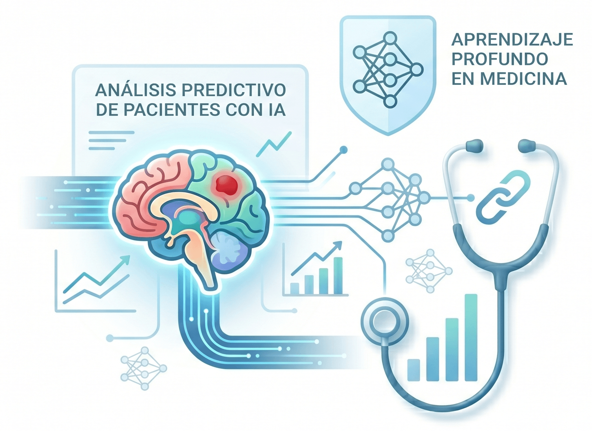{fig-align="center"}

------------------------------------------------------------------------

## Inteligencia Artificial

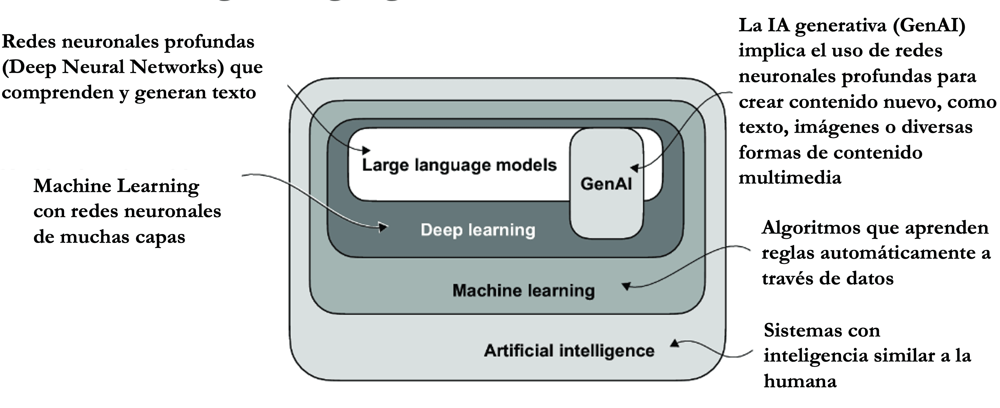{fig-align="center"}

## ¿Qué es una Red Neuronal? {.smaller}

:::: {.columns}

::: {.column width="50%"}
Piénsalo como un **sistema de toma de decisiones** inspirado en el cerebro:

- **Entradas**: Datos crudos (ej., valores de píxeles de una imagen del pulmón)
- **Capas ocultas**: Cada capa aprende a detectar patrones cada vez más complejos
- **Salida**: Una predicción (ej., "esta radiografía presenta neumonía")

La red **aprende por ejemplo** — le mostramos miles de imágenes del pulmon ya etiquetadas, y descubre qué patrones corresponden a cada tipo de enfermedad.
:::

::: {.column width="50%"}

{width="85%" fig-align="center"}

:::

::::

## Predicciones en radiología

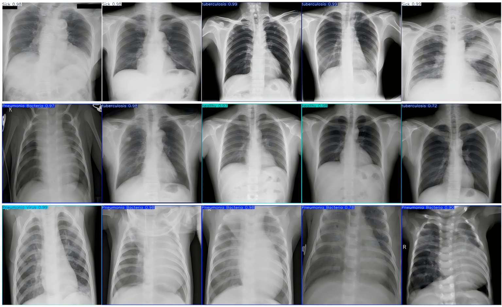{fig-align="center"}

## Predicciones en radiología

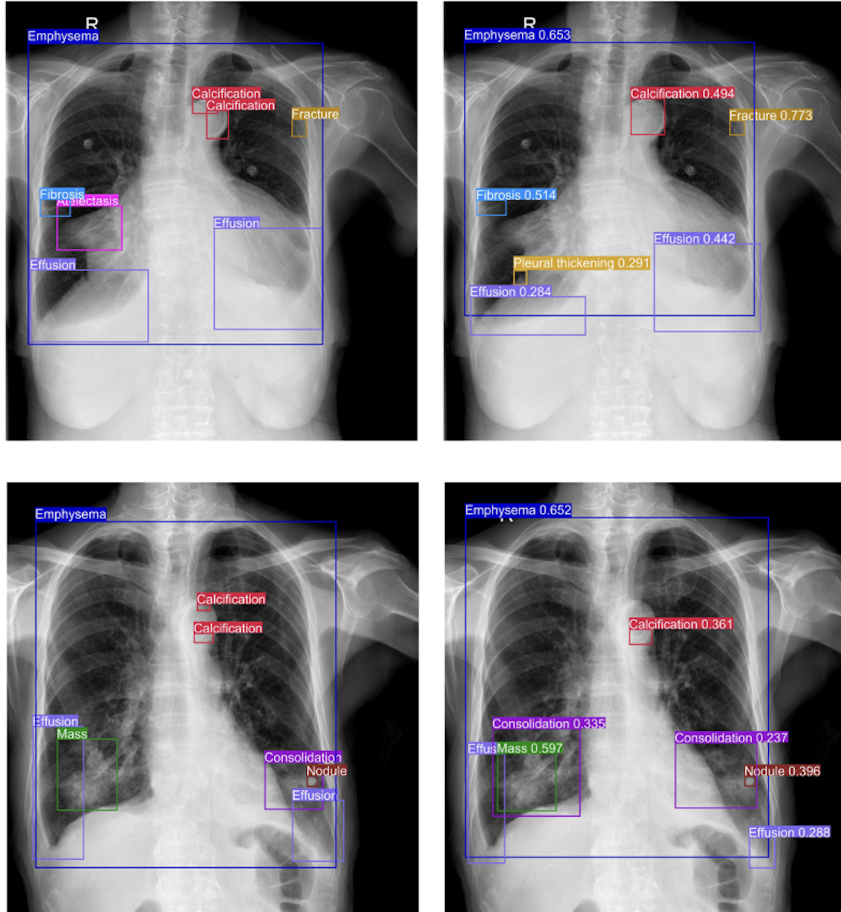{fig-align="center"}

## Las LLMs predicen la siguiente palabra

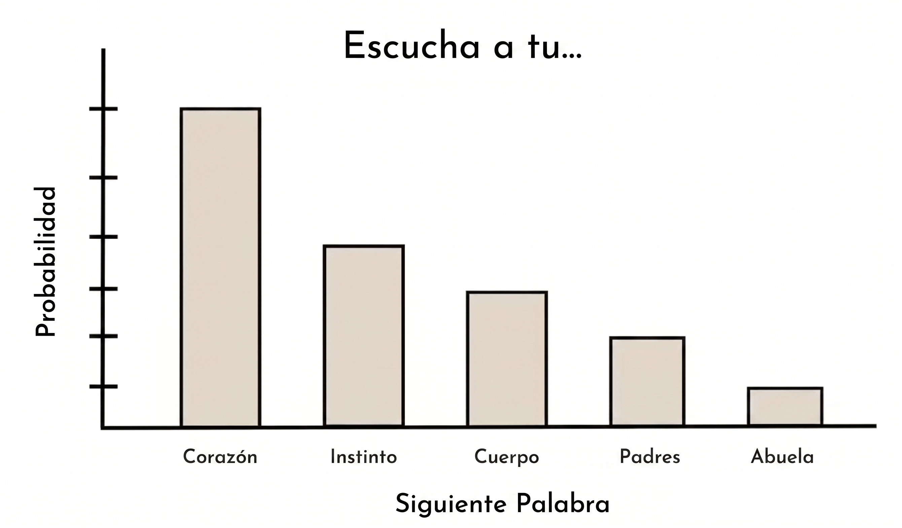{fig-align="center"}

## Dividir el lenguaje en tokens

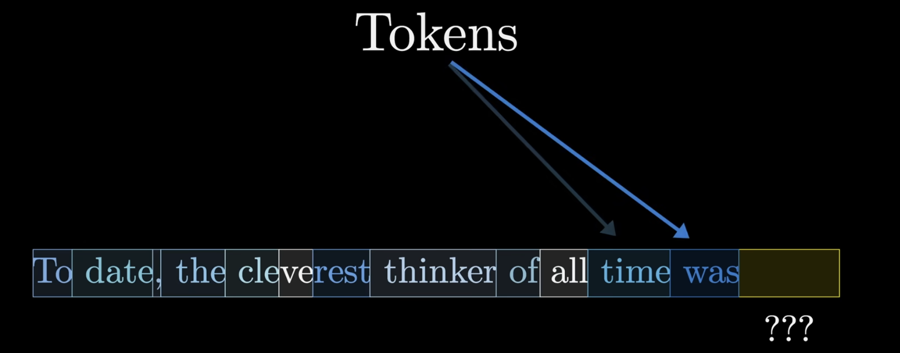{fig-align="center"}

## Convertir los tokens a algo que comprendan las computadoras (embeddings)

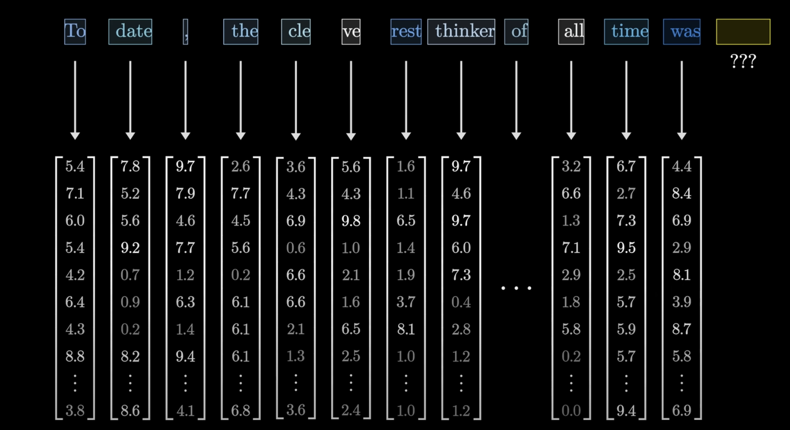{fig-align="center"}

## Las palabras similares están cerca entre ellas

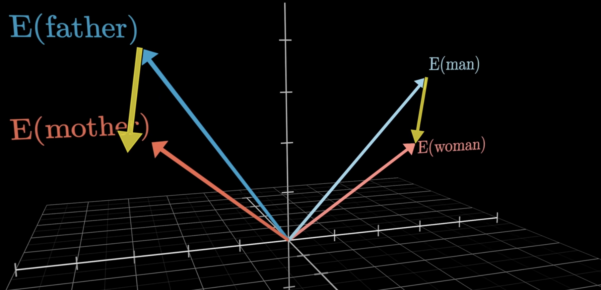{fig-align="center"}

## La magia detrás de las LLM es Deep Neural Networks

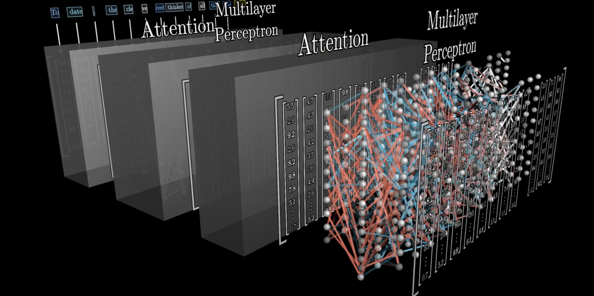{fig-align="center"}

## La magia detrás de las LLM es Deep Neural Networks

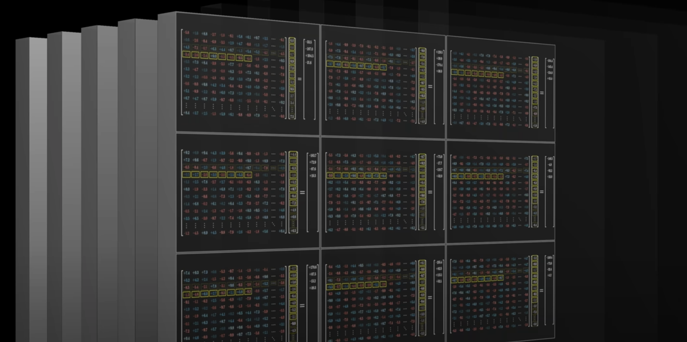{fig-align="center"}

## La magia detrás de las LLM es Deep Neural Networks

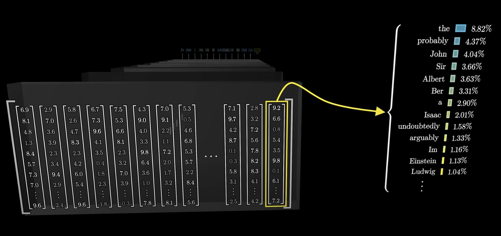{fig-align="center"}

## El secreto detrás de los chatbots que usamos

{fig-align="center"}

## APOLLO - Representación virtual de un paciente

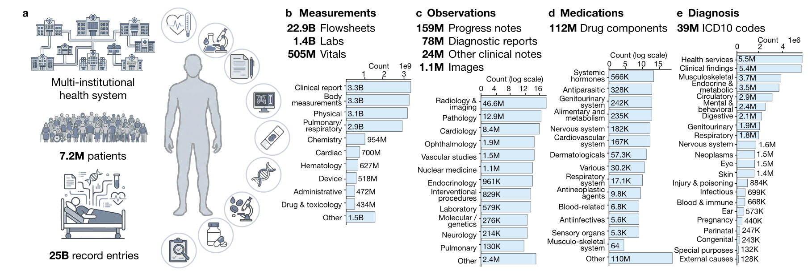{fig-align="center"}

::: aside
Zhang A, Ding T, Wagner SJ, et al. A multimodal and temporal foundation model for virtual patient representations at healthcare system scale. arXiv:2604.18570, 2026.
:::

## APOLLO - Representación virtual de un paciente

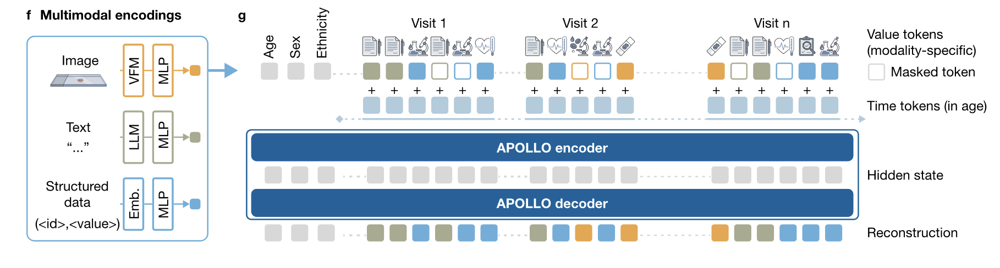{fig-align="center"}

::: aside
Zhang A, Ding T, Wagner SJ, et al. A multimodal and temporal foundation model for virtual patient representations at healthcare system scale. arXiv:2604.18570, 2026.
:::

## APOLLO - Representación virtual de un paciente

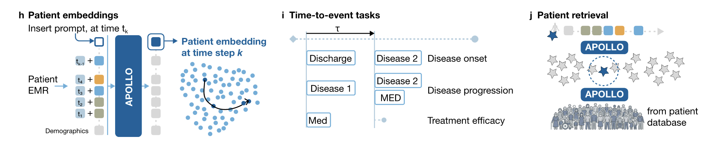{fig-align="center"}

::: aside
Zhang A, Ding T, Wagner SJ, et al. A multimodal and temporal foundation model for virtual patient representations at healthcare system scale. arXiv:2604.18570, 2026.
:::

## APOLLO - Representación virtual de un paciente

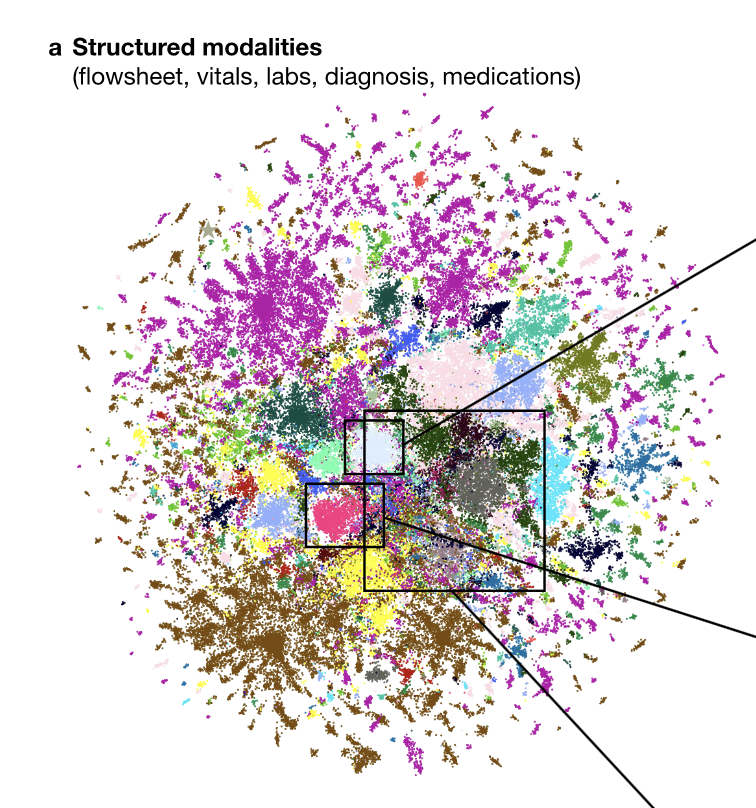{fig-align="center" style="max-height: 50vh;"}

::: aside
Zhang A, Ding T, Wagner SJ, et al. A multimodal and temporal foundation model for virtual patient representations at healthcare system scale. arXiv:2604.18570, 2026.
:::

## APOLLO - Representación virtual de un paciente

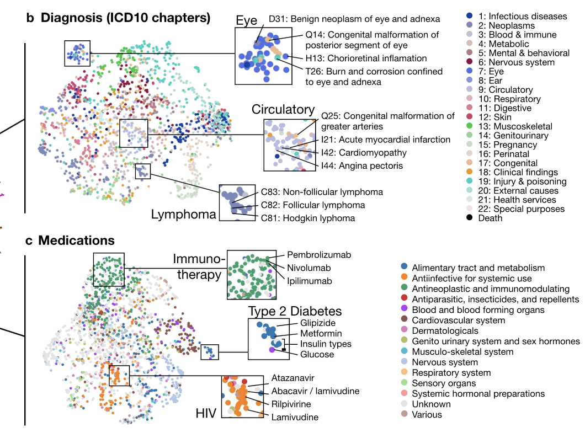{fig-align="center" style="max-height: 50vh;"}

::: aside
Zhang A, Ding T, Wagner SJ, et al. A multimodal and temporal foundation model for virtual patient representations at healthcare system scale. arXiv:2604.18570, 2026.
:::

## APOLLO - Representación virtual de un paciente

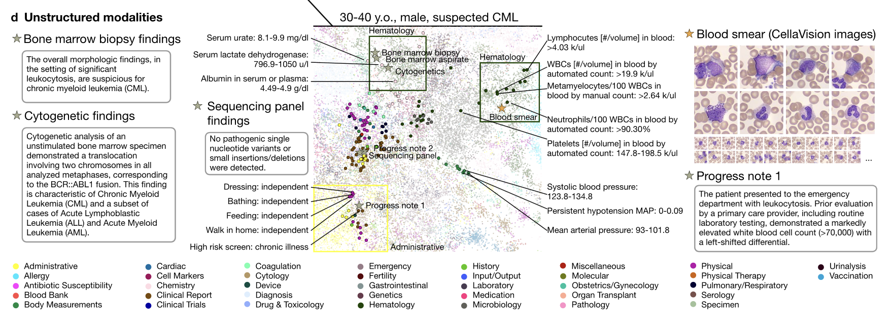{fig-align="center"}

::: aside
Zhang A, Ding T, Wagner SJ, et al. A multimodal and temporal foundation model for virtual patient representations at healthcare system scale. arXiv:2604.18570, 2026.
:::

## Concluciones

- Los datos por sí solos no bastan; convienen una recolección rigurosa, limpieza, análisis e interpretación clínica para generar impacto.
- Niveles de aplicación: Clínica, Salud pública, Investigación y Bioinformática.
- IA y SOTA en salud: modelos de visión (radiología), LLMs y embeddings para texto clínico, y modelos multimodales para representación del paciente.
- Consideraciones críticas: calidad de datos, validación clínica, interpretación y ética en el uso de IA en salud.

::: notes
Resalta los llamados a la acción y las consideraciones éticas. Mantener el resumen claro y accionable.
:::

## Maestría en Ciencia de Datos en Salud - USAC

🎓 **Nuevo programa de la Universidad de San Carlos de Guatemala**

-   Formación práctica en análisis de datos de salud.\
-   Integración entre informática, estadística y medicina.\
-   Preparación para los desafíos de la salud digital y la bioinformática clínica.

------------------------------------------------------------------------

## ¡Gracias!

**Contacto:**\
📧 oliver.mazariegos98\@gmail.com\
💬 LinkedIn: https://www.linkedin.com/in/oliver-mazariegos

> “El futuro de la salud se construye con datos, ética y colaboración.”
